# TripOS Entity Relationship Model

Last reviewed: 2026-08-20

This document maps the implemented MongoDB/Mongoose schemas in `tripos-api-server`. TripOS uses MongoDB documents, so relationships are stored as string reference fields such as `organizationId`, `branchId`, `userId`, `leadId`, `customerId`, `bookingId`, and `entityId` rather than enforced SQL foreign keys.

## Relationship Principles

- `organizations` is the primary business isolation boundary.
- Most business records store `organizationId`; branch-aware records also store `branchId`.
- Platform-managed records such as `pricing_plans` and `permissions` may be global.
- User access is modeled through `users`, `roles`, `permissions`, `user_roles`, and `role_permissions`.
- Bounded operational details remain embedded arrays/objects, for example booking passengers, quotation services, supplier rates, B2B KYC documents, invoice line items, voucher line items, and support messages.
- Polymorphic activity modules use `entityType` plus `entityId` to attach to any business entity.

## Full ER Diagram

```mermaid
erDiagram
  ORGANIZATIONS ||--o{ BRANCHES : owns
  ORGANIZATIONS ||--o{ DEPARTMENTS : owns
  ORGANIZATIONS ||--o{ TEAMS : owns
  ORGANIZATIONS ||--o{ USERS : owns
  ORGANIZATIONS ||--o{ ROLES : owns
  ORGANIZATIONS ||--o{ USER_ROLES : grants
  ORGANIZATIONS ||--o{ ROLE_PERMISSIONS : grants
  ORGANIZATIONS ||--o{ INVITATIONS : sends
  ORGANIZATIONS ||--o{ USER_SESSIONS : scopes
  ORGANIZATIONS ||--o{ AUDIT_LOGS : audits

  BRANCHES ||--o{ DEPARTMENTS : contains
  DEPARTMENTS ||--o{ TEAMS : contains
  USERS ||--o{ USER_SESSIONS : creates
  USERS ||--o{ USER_ROLES : assigned
  ROLES ||--o{ USER_ROLES : assigned
  ROLES ||--o{ ROLE_PERMISSIONS : includes
  PERMISSIONS ||--o{ ROLE_PERMISSIONS : granted_by_code

  ORGANIZATIONS ||--o{ LEADS : owns
  ORGANIZATIONS ||--o{ CUSTOMERS : owns
  ORGANIZATIONS ||--o{ QUOTATIONS : owns
  ORGANIZATIONS ||--o{ ITINERARIES : owns
  ORGANIZATIONS ||--o{ BOOKINGS : owns
  ORGANIZATIONS ||--o{ SUPPLIERS : owns
  ORGANIZATIONS ||--o{ OPERATION_TASKS : owns
  ORGANIZATIONS ||--o{ B2B_AGENTS : owns
  ORGANIZATIONS ||--o{ PAYMENTS : owns
  ORGANIZATIONS ||--o{ INVOICES : owns
  ORGANIZATIONS ||--o{ DESTINATIONS : owns
  ORGANIZATIONS ||--o{ TOUR_PACKAGES : owns
  ORGANIZATIONS ||--o{ TRAVEL_DOCUMENTS : owns
  ORGANIZATIONS ||--o{ VOUCHERS : owns
  ORGANIZATIONS ||--o{ SUPPORT_TICKETS : owns
  ORGANIZATIONS ||--o{ NOTIFICATIONS : owns
  ORGANIZATIONS ||--o{ CAMPAIGNS : owns

  LEADS ||--o{ LEAD_ACTIVITIES : records
  LEADS ||--o{ QUOTATIONS : source
  LEADS ||--o{ BOOKINGS : source
  CUSTOMERS ||--o{ QUOTATIONS : receives
  CUSTOMERS ||--o{ BOOKINGS : books
  CUSTOMERS ||--o{ PAYMENTS : pays
  CUSTOMERS ||--o{ INVOICES : billed
  CUSTOMERS ||--o{ TRAVEL_DOCUMENTS : owns
  CUSTOMERS ||--o{ VOUCHERS : receives
  CUSTOMERS ||--o{ SUPPORT_TICKETS : opens
  QUOTATIONS ||--o{ ITINERARIES : includes
  QUOTATIONS ||--o{ BOOKINGS : converts_to
  QUOTATIONS ||--o{ INVOICES : billed_from
  BOOKINGS ||--o{ OPERATION_TASKS : requires
  BOOKINGS ||--o{ PAYMENTS : scheduled
  BOOKINGS ||--o{ INVOICES : billed
  BOOKINGS ||--o{ TRAVEL_DOCUMENTS : requires
  BOOKINGS ||--o{ VOUCHERS : issues
  BOOKINGS ||--o{ SUPPORT_TICKETS : supports
  SUPPLIERS ||--o{ VOUCHERS : confirms
  B2B_AGENTS ||--o{ QUOTATIONS : requests
  B2B_AGENTS ||--o{ BOOKINGS : books
  B2B_AGENTS ||--o{ PAYMENTS : settles

  ORGANIZATIONS ||--o{ SETTINGS : configures
  ORGANIZATIONS ||--o{ TAGS : classifies
  ORGANIZATIONS ||--o{ TASKS : tracks
  ORGANIZATIONS ||--o{ STORED_FILES : stores
  ORGANIZATIONS ||--o{ SAVED_REPORTS : defines
  ORGANIZATIONS ||--o{ WORKFLOW_RULES : automates
  ORGANIZATIONS ||--o{ COMMUNICATIONS : sends
  ORGANIZATIONS ||--o{ FEATURE_FLAGS : controls
  ORGANIZATIONS ||--o{ IMPORT_EXPORT_JOBS : processes
  ORGANIZATIONS ||--o{ OPERATING_RECORDS : extends
  ORGANIZATIONS ||--o{ SUBSCRIPTIONS : subscribes
  PRICING_PLANS ||--o{ SUBSCRIPTIONS : selected

  TASKS }o--|| USERS : assigned_to
  STORED_FILES }o--|| USERS : uploaded_by
  AUDIT_LOGS }o--|| USERS : actor
  OPERATING_RECORDS }o--o| USERS : owner_or_assignee
  OPERATING_RECORDS }o--o| BOOKINGS : polymorphic_entity
  OPERATING_RECORDS }o--o| CUSTOMERS : polymorphic_entity
  OPERATING_RECORDS }o--o| LEADS : polymorphic_entity
```

## Identity And Access Collections

| Collection | Schema class | Key fields | Primary relationships |
| --- | --- | --- | --- |
| `organizations` | `Organization` | `code`, `name`, `dataHostingMode`, `branches`, `syncPolicy`, `billingProfile`, `subscription`, `branding`, `status` | Root isolation boundary. Owns branches, users, business records, settings, subscriptions, files, reports, and audit logs. |
| `branches` | `Branch` | `organizationId`, `name`, `code`, `branchType`, `city`, `country`, `timezone`, `managerUserId`, `operatingHours`, `taxProfile`, `contactPerson`, `status` | Belongs to organization. Parent for departments, teams, users, and branch-scoped business records. |
| `departments` | `Department` | `organizationId`, `branchId`, `name`, `code`, `departmentType`, `managerUserId`, `escalationUserId`, `serviceModules`, `slaPolicy`, `status` | Belongs to organization and branch. Can be assigned to users, teams, roles, tasks, leads, and operational ownership. |
| `teams` | `Team` | `organizationId`, `branchId`, `departmentId`, `name`, `code`, `leadUserId`, `memberUserIds`, `skillTags`, `supportedDestinations`, `capacity`, `queueRules`, `status` | Belongs to department. References users through `leadUserId` and `memberUserIds`. |
| `users` | `User` | `organizationId`, `branchId`, `branchIds`, `departmentIds`, `teamIds`, `name`, `email`, `role`, `permissions`, `status` | Organization/platform users for CRM access. Referenced by sessions, user roles, owners, assignees, managers, audit logs, tasks, files, and workflow actors. |
| `user_sessions` | `UserSession` | `tokenHash`, `userId`, `organizationId`, `branchId`, `expiresAt`, `revokedAt`, `device` | Belongs to a user and selected organization/branch workspace. |
| `roles` | `Role` | `organizationId`, `name`, `code`, `roleType`, `defaultBranchIds`, `defaultDepartmentIds`, `defaultTeamIds`, `limits`, `status` | Organization role definition. Assigned through `user_roles`; permissions through `role_permissions`. |
| `permissions` | `Permission` | `module`, `action`, `code`, `label`, `status` | Platform permission registry. Referenced by `role_permissions.permissionCode` and direct user permission strings. |
| `user_roles` | `UserRole` | `organizationId`, `userId`, `roleId`, `branchIds`, `departmentIds`, `teamIds`, `status` | Join collection between users and roles with access scope. |
| `role_permissions` | `RolePermission` | `organizationId`, `roleId`, `permissionCode`, `scope`, `conditions`, `status` | Join collection between roles and permission codes. |
| `invitations` | `Invitation` | `organizationId`, `branchId`, `email`, `name`, `role`, `branchIds`, `departmentIds`, `teamIds`, `tokenHash`, `expiresAt`, `status` | Pending user onboarding records. Creates or activates users after acceptance. |
| `audit_logs` | `AuditLog` | `organizationId`, `branchId`, `actorId`, `actorRole`, `action`, `method`, `path`, `entityType`, `entityId`, `outcome` | Immutable audit trail for user actions and sensitive reads/mutations. |

## Travel CRM And Operations Collections

| Collection | Schema class | Key fields | Primary relationships |
| --- | --- | --- | --- |
| `leads` | `Lead` | `organizationId`, `branchId`, `customerName`, `email`, `phone`, `source`, `channel`, `requirement`, `assignedTo`, `ownerId`, `teamId`, `departmentId`, `stage`, `temperature`, `score` | Owned by organization/branch. Can convert to quotations/bookings/customers. Has lead activities. |
| `lead_activities` | `LeadActivity` | `organizationId`, `leadId`, `type`, `subject`, `description`, `actorId`, `channel`, `occurredAt` | Child timeline for leads; actor references users. |
| `customers` | `Customer` | `organizationId`, `branchId`, `name`, `email`, `phone`, `customerType`, `source`, `ownerId`, `assignedTo`, `agentId`, `companyName`, `travellers`, `emergencyContacts`, `documents`, `preferences`, `consent`, `loyalty`, `riskProfile`, `status` | Central traveller/company profile. Referenced by quotations, bookings, invoices, payments, documents, vouchers, and tickets. |
| `quotations` | `Quotation` | `organizationId`, `branchId`, `leadId`, `customerId`, `quoteNo`, `ownerId`, `agentId`, `customerName`, `destination`, `services`, `pricing`, `margins`, `validUntil`, `status` | Created from leads/customers/B2B agents. Converts to booking. Can produce itinerary and invoice document output. |
| `itineraries` | `Itinerary` | `organizationId`, `branchId`, `quotationId`, `bookingId`, `customerId`, `title`, `destination`, `days`, `inclusions`, `exclusions`, `images`, `status` | Attached to quotation and/or booking; stores day-wise itinerary as embedded records. |
| `bookings` | `Booking` | `organizationId`, `branchId`, `quotationId`, `leadId`, `customerId`, `bookingNo`, `ownerId`, `agentId`, `passengers`, `services`, `documents`, `paymentSchedule`, `vouchers`, `status` | Operational transaction created from quotation/lead/customer. Parent for payments, invoices, documents, vouchers, tasks, and tickets. |
| `suppliers` | `Supplier` | `organizationId`, `branchId`, `name`, `type`, `destination`, `supplierCode`, `ownerId`, `contacts`, `contracts`, `rates`, `confirmations`, `payable`, `rating`, `status` | Service vendors for hotels, transfers, guides, activities, visas, and confirmations. Referenced by vouchers and embedded booking/quotation services. |
| `operation_tasks` | `OperationTask` | `organizationId`, `branchId`, `bookingId`, `supplierId`, `title`, `category`, `assignedTo`, `ownerId`, `dueAt`, `sla`, `escalations`, `timeline`, `status` | Booking/supplier operational checklist and SLA work. Assignees/owners reference users. |
| `b2b_agents` | `B2BAgent` | `organizationId`, `branchId`, `agencyName`, `agentCode`, `ownerId`, `contactName`, `email`, `phone`, `market`, `creditLimit`, `receivable`, `commissionEarned`, `kycDocuments`, `walletLedger`, `status` | Agent/company profile for B2B sales. Referenced by quotations, bookings, and payments through `agentId`. |
| `payments` | `Payment` | `organizationId`, `branchId`, `type`, `partyType`, `partyId`, `partyName`, `bookingId`, `invoiceId`, `amount`, `amountMinor`, `currency`, `dueDate`, `paidDate`, `status` | Receivables, payables, refunds, and commissions for customers, agents, suppliers, bookings, and invoices. |
| `invoices` | `Invoice` | `organizationId`, `branchId`, `invoiceSeries`, `invoiceNo`, `customerId`, `bookingId`, `quotationId`, `entries`, `totals`, `totalsMinor`, `paymentTerms`, `status`, `locked` | Finance document linked to customer/booking/quotation. Entries and tax totals are embedded. |
| `destinations` | `Destination` | `organizationId`, `name`, `country`, `region`, `bestSeason`, `highlights`, `visaRequirement`, `geo`, `content`, `seo`, `status` | Destination master data used by packages, leads, quotations, bookings, and website content. |
| `tour_packages` | `TourPackage` | `organizationId`, `branchId`, `title`, `destinationId`, `supplierId`, `audience`, `packageType`, `destination`, `category`, `packageCode`, `durationDays`, `durationNights`, `basePriceMinor`, `departures`, `pricingRules`, `commissionPolicy`, `publishing`, `status` | Sellable package catalogue based on destinations. Can feed public website, leads, quotations, and campaigns. |
| `travel_documents` | `TravelDocument` | `organizationId`, `branchId`, `customerId`, `bookingId`, `passengerId`, `travellerName`, `documentType`, `documentNumber`, `fileId`, `expiryDate`, `verifiedBy`, `verificationHistory`, `security`, `status` | Traveller document registry. May reference stored files and bookings/customers. |
| `vouchers` | `Voucher` | `organizationId`, `branchId`, `bookingId`, `customerId`, `voucherType`, `serviceType`, `voucherNo`, `supplierId`, `supplierName`, `confirmationNumber`, `fileId`, `supplierConfirmation`, `travellerInstructions`, `delivery`, `status` | Booking service voucher, often supplier-confirmed. |
| `support_tickets` | `SupportTicket` | `organizationId`, `branchId`, `ticketNo`, `customerId`, `bookingId`, `agentId`, `supplierId`, `customerName`, `channel`, `priority`, `assignedTo`, `ownerId`, `departmentId`, `teamId`, `sla`, `escalations`, `messages`, `status` | Support workflow for customer/booking/agent/supplier issues. Messages and escalations embedded. |
| `notifications` | `Notification` | `organizationId`, `branchId`, `type`, `priority`, `audience`, `userId`, `agentId`, `customerId`, `entityType`, `entityId`, `title`, `message`, `actionUrl`, `delivery`, `status` | User/branch/organization alert records. Can point to any entity through `entityType/entityId`. |
| `campaigns` | `Campaign` | `organizationId`, `branchId`, `name`, `channel`, `source`, `medium`, `campaignType`, `ownerId`, `segmentId`, `landingPageUrl`, `campaignCode`, `budget`, `goals`, `content`, `impressions`, `clicks`, `leads`, `revenue`, `roi`, `status` | Marketing attribution and campaign performance. Feeds leads and reports. |

## Platform, Automation, Files, And Reporting Collections

| Collection | Schema class | Key fields | Primary relationships |
| --- | --- | --- | --- |
| `pricing_plans` | `PricingPlan` | `code`, `name`, `audience`, `billingCycle`, `currencyCode`, `priceMinor`, `includedSeats`, `features`, `limits`, `providerPrices`, `status` | Platform plan catalogue. Referenced by subscriptions through `planCode`. |
| `subscriptions` | `Subscription` | `organizationId`, `branchId`, `planCode`, `planName`, `billingCycle`, `amountMinor`, `seats`, `trialEndsAt`, `renewsAt`, `paymentProvider`, `providerSubscriptionId`, `billingProfile`, `status` | Organization subscription state and billing snapshot. |
| `settings` | `Setting` | `organizationId`, `branchId`, `key`, `label`, `category`, `value`, `metadata`, `status` | Organization/branch configuration. |
| `tags` | `Tag` | `organizationId`, `branchId`, `name`, `color`, `module`, `description`, `status` | Taxonomy for records across modules. Business records store tag names as arrays. |
| `tasks` | `Task` | `organizationId`, `branchId`, `title`, `module`, `entityId`, `assignedTo`, `priority`, `dueAt`, `status` | Generic task linked to a module/entity. Assignee references user. |
| `stored_files` | `StoredFile` | `organizationId`, `branchId`, `entityType`, `entityId`, `fileName`, `mimeType`, `size`, `storageDriver`, `storageKey`, `uploadedBy`, `status` | File registry for documents, vouchers, receipts, contracts, and generated outputs. |
| `saved_reports` | `SavedReport` | `organizationId`, `branchId`, `name`, `module`, `filters`, `schedule`, `recipients`, `nextRunAt`, `lastRunAt`, `lastRunStatus`, `status` | Scheduled or reusable reporting definitions. |
| `workflow_rules` | `WorkflowRule` | `organizationId`, `branchId`, `name`, `code`, `module`, `trigger`, `conditions`, `actions`, `priority`, `runOnce`, `status` | Automation rules for module events such as status changes and SLA checks. |
| `communications` | `Communication` | `organizationId`, `branchId`, `channel`, `category`, `entityType`, `entityId`, `recipient`, `templateCode`, `provider`, `providerMessageId`, `scheduledAt`, `sentAt`, `status` | Email/SMS/WhatsApp/push/call log attached to any entity. |
| `feature_flags` | `FeatureFlag` | `organizationId`, `branchId`, `key`, `label`, `category`, `enabled`, `rollout`, `rules`, `status` | Organization/branch feature rollout control. |
| `import_export_jobs` | `ImportExportJob` | `organizationId`, `branchId`, `jobType`, `module`, `fileName`, `format`, `totalRows`, `successRows`, `failedRows`, `requestedBy`, `completedAt`, `status` | Import/export processing and audit status by module. |
| `operating_records` | `OperatingRecord` | `organizationId`, `branchId`, `moduleKey`, `title`, `code`, `category`, `entityType`, `entityId`, `ownerId`, `assignedTo`, `priority`, `dueAt`, `status` | Shared records for contacts, activities, follow-ups, meetings, notes, service catalog, custom fields, call center, field force, content, and analytics. |

## Important Embedded Structures

| Parent collection | Embedded field | Purpose |
| --- | --- | --- |
| `organizations` | `branches`, `billingProfile`, `subscription`, `branding`, `compliance`, `securityPolicy`, `integrations`, `syncPolicy` | Organization profile, defaults, billing/compliance, and customer-managed storage/sync configuration. |
| `leads` | `requirement`, `consent`, `customFields`, `metadata` | Travel requirement capture and flexible CRM fields. |
| `quotations` | `services`, `pricing`, `margins`, `terms`, `approval` | Quote line items, commercial calculation, approval, and terms. |
| `itineraries` | `days`, `inclusions`, `exclusions`, `images`, `notes` | Day-wise itinerary builder content. |
| `bookings` | `passengers`, `services`, `documents`, `paymentSchedule`, `vouchers`, `operationChecklist`, `commercial`, `supplierCosting` | Booking execution and finance/operations snapshot. |
| `suppliers` | `contacts`, `contracts`, `rates`, `confirmations`, `taxProfile`, `bankDetails`, `paymentTerms`, `compliance` | Vendor commercial and compliance data. |
| `b2b_agents` | `kycDocuments`, `walletLedger`, `commissionLedger`, `invoices`, `taxProfile`, `bankDetails`, `creditPolicy` | Agent onboarding, settlement, and commercial terms. |
| `support_tickets` | `messages`, `satisfaction` | Conversation and support feedback. |
| `invoices` | `provider`, `customer`, `entries`, `totals`, `totalsMinor`, `paymentTerms`, `eInvoice`, `exportDetails` | Country-aware invoice output and tax calculations. |
| `stored_files` | `retention`, `scanResult`, `metadata` | Storage lifecycle, security scan, and file metadata. |

## Polymorphic Reference Rules

These collections intentionally support cross-module references:

- `tasks.module + tasks.entityId`
- `stored_files.entityType + stored_files.entityId`
- `audit_logs.entityType + audit_logs.entityId`
- `notifications.entityType + notifications.entityId`
- `communications.entityType + communications.entityId`
- `operating_records.moduleKey + operating_records.entityType + operating_records.entityId`

Allowed `operating_records.moduleKey` values are:

- `contacts`
- `activities`
- `follow-ups`
- `meetings`
- `notes`
- `service-catalog`
- `custom-fields`
- `call-center`
- `field-force`
- `content`
- `analytics`

## Relationship Notes For Production

- The application must always query organization-owned collections with `organizationId` and, when applicable, `branchId`.
- Do not trust client-submitted organization values for protected routes; use authenticated workspace context.
- Keep `users.email` unique per organization, not globally, so the same person can belong to multiple organizations.
- Keep `pricing_plans` global unless custom/private plan catalogs become a requirement.
- Use `stored_files` as the canonical file registry; business modules should reference files by `fileId` or embedded document records.
- Promote embedded arrays to dedicated collections only when they require independent permissions, high-volume reporting, lifecycle status history, or separate auditability.
